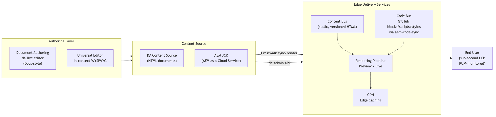

# Content Authoring on Edge Delivery Services
## Document Authoring (DA.live) vs. Crosswalk (Universal Editor + AEM JCR)

Two paths to the same fast, edge-delivered front end

---

## Agenda

1. What is Edge Delivery Services (EDS)?
2. Document Authoring (DA.live) — overview
3. Crosswalk (Universal Editor + AEM as a Cloud Service) — overview
4. Capability comparison
5. Where the two approaches meet: architecture
6. When to choose which
7. Recommendation

---

## Edge Delivery Services in one slide

EDS separates **content/authoring** from **code**, and delivers everything through a CDN-first pipeline optimized for Core Web Vitals.

- **Code Bus** — blocks, scripts, styles, hosted in GitHub, synced via `aem-code-sync`
- **Content Bus** — the authored content, converted to static, cacheable HTML
- **Delivery** — CDN-served, sub-second LCP, RUM-based performance monitoring
- **Two supported ways to populate the Content Bus:**
  - Document Authoring (DA.live)
  - Crosswalk (AEM as a Cloud Service / Universal Editor)

Both roads lead to the *same* delivery tier — the difference is entirely upstream, in **how and where content is authored and governed**.

---

## Option 1 — Document Authoring (DA.live)

A lightweight, document-style authoring experience — no AEM instance required.

- Authors write in a **Word/Google Docs-like editor** (da.live)
- Content stored as HTML documents in Adobe's DA content source (not JCR)
- Comments and version history for review and rollback
- Authors compose pages from **sections + blocks** directly in the document
- No servers or repository to operate — purpose-built for the aem.live/EDS ecosystem
- **Personalization**: Target/RT-CDP integrate at the edge layer, independent of content source — same audience targeting, A/B testing, and RUM-driven optimization as Crosswalk

**Best fit:** marketing sites, campaign microsites, decentralized teams, fast time-to-value.

---

## Option 2 — Crosswalk (Universal Editor + AEM JCR)

Full AEM as a Cloud Service backend, rendered out through the EDS pipeline.

- Content lives in the **JCR** — AEM's enterprise content repository
- Authors edit **in-context on the live page** via the Universal Editor (click-to-edit WYSIWYG)
- Full AEM platform underneath: Content Fragments, DAM/Assets, Multi-Site Manager, workflows, versioning, granular ACLs
- Integrates with the broader Experience Cloud stack (Target, RT-CDP, Translation)
- A rendering/sync layer ("crosswalk") converts JCR content + component definitions into EDS-compliant markup
- Requires an AEM as a Cloud Service license and environment to operate

**Best fit:** enterprises already on AEM, complex governance, multi-site/multi-market reuse, DAM-grade asset management.

---

## Capability Comparison (1/2)

| Capability | Document Authoring (DA.live) | Crosswalk (Universal Editor + JCR) |
|---|---|---|
| Content store | DA content source (HTML docs) | AEM JCR (enterprise repository) |
| Authoring UX | Document editor (Docs/Word-like) | In-context WYSIWYG on rendered page |
| Backend required | None — fully decoupled | AEM as a Cloud Service |
| Setup & ops complexity | Low | Higher (AEM environment, sync pipeline) |
| Collaboration | Comments, version history | AEM workflows, review/approval steps |
| Content reuse (fragments) | Limited | Content Fragments, Experience Fragments |
| DAM / asset governance | Basic Asset Selector | Full AEM Assets / DAM |

---

## Capability Comparison (2/2)

| Capability | Document Authoring (DA.live) | Crosswalk (Universal Editor + JCR) |
|---|---|---|
| Multi-site / multi-market | Manual/per-site | Multi-Site Manager (MSM), Launches |
| Personalization | Target, RT-CDP integration (edge-based) | Target, RT-CDP integration (edge-based) |
| Permissions & governance | Lightweight | Enterprise-grade ACLs, workflows |
| Versioning | Document history | Full JCR versioning |
| Licensing cost | Included with EDS | Requires AEM as a Cloud Service |
| Time to first page | Hours | Days–weeks (environment setup) |
| Performance on delivery | Identical (same EDS pipeline) | Identical (same EDS pipeline) |

---

## Architecture — Where Both Approaches Meet

**Key point:** Content Bus population differs (DA vs. AEM/Crosswalk), but Code Bus, rendering pipeline, CDN, and performance characteristics are **identical and shared**. Personalization (Target/RT-CDP) also lives at this shared edge layer, so it's available equally to both authoring paths. Sites can even mix approaches per section if needed.

---

## When to Choose Which

**Choose Document Authoring when:**
- No existing AEM investment, or a net-new/marketing site
- Speed of setup and low operational overhead matter most
- Content structure is straightforward (sections + blocks)
- Team is small/decentralized, minimal formal governance needed

**Choose Crosswalk when:**
- Already running AEM as a Cloud Service, or need its content model
- Multi-site/multi-market content reuse, DAM, or Experience Cloud integration is required
- Formal workflows, approvals, and granular permissions are mandatory

*(Personalization via Target/RT-CDP runs at the shared edge layer, not the content source — available equally on both paths.)*

---

## Recommendation

- Both deliver the **same front-end performance** — the decision is a **content operations and governance** decision, not a performance one.
- Default to **Document Authoring** for greenfield, marketing-led, or decentralized use cases — lowest cost, fastest time to value.
- Choose **Crosswalk** where enterprise content governance, DAM, multi-site reuse, or existing AEM investment justify the added operational complexity.
- Because both converge on the same Edge Delivery Services pipeline, the choice **can be made per site or even per section** — and revisited later without re-architecting delivery.

---

# Questions?
